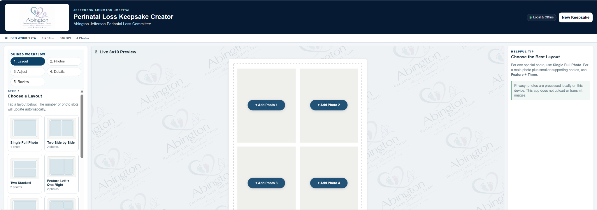
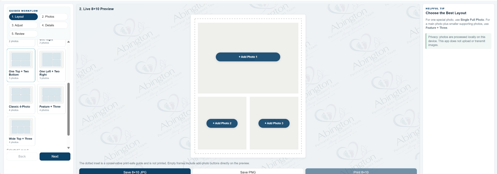
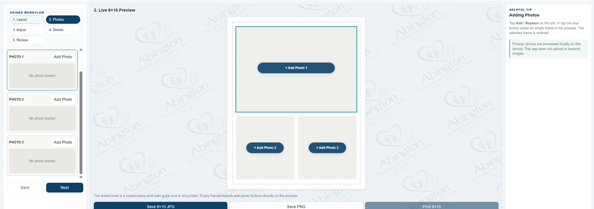
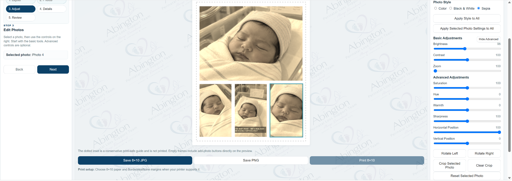
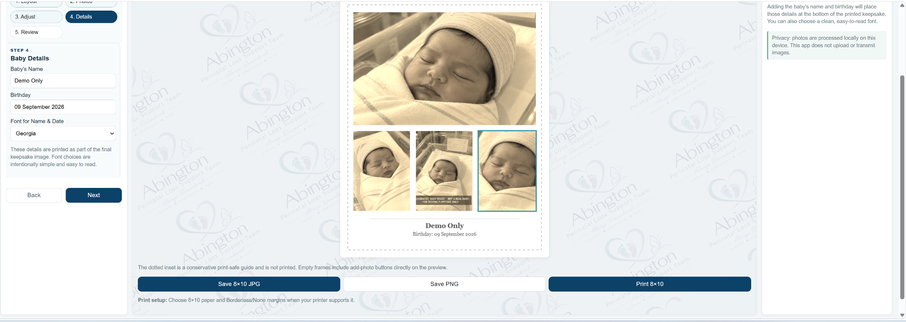
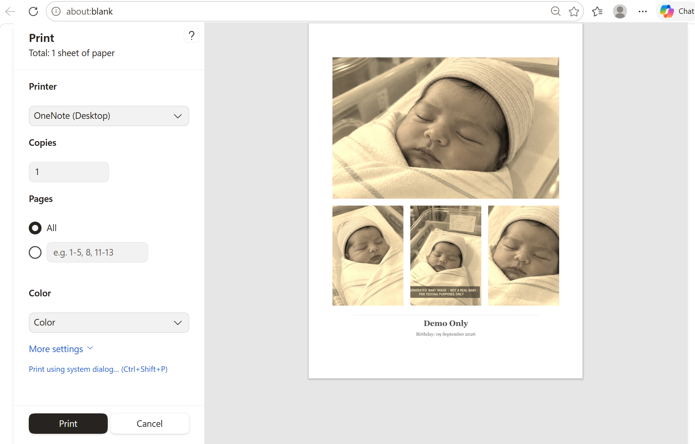

# Perinatal Loss Keepsake Creator

A browser-based, Chromebook-friendly Progressive Web App designed to help perinatal loss support teams create respectful, print-ready **8 × 10 memorial keepsakes** for families.

## Current Version

**v2.7 PWA**

**Status:** Working software / active development pending organizational review and approval.

## Purpose

The Perinatal Loss Keepsake Creator provides a guided workflow for creating a memorial keepsake using one to four photographs, required baby name and birthday text, and simple photo-editing controls.

The application is designed around Jefferson Abington Hospital / Abington Jefferson Perinatal Loss Committee workflows and is intended to be simple enough for clinical staff to use without specialized image-editing software.

## Project Donation

This software was developed and **donated for use in support of the Jefferson Abington Hospital / Abington Jefferson Perinatal Loss Committee workflow**. The repository documents the application, its development history, and its technical implementation.

The donation of the software does not grant third parties permission to reuse Jefferson Abington Hospital or committee names, logos, or trademarks. Any questions of software ownership, redistribution rights, or organizational deployment remain subject to the applicable agreements and organizational policies.

## Features

- Installable Progressive Web App (PWA)
- Chromebook and modern browser support
- Offline-capable operation after initial installation/cache
- 1-, 2-, 3-, and 4-photo layouts
- Live 8 × 10 preview
- Individual photo cropping and positioning
- Brightness, contrast, saturation, hue, warmth, sharpness, zoom, rotation, and position controls
- Color, black-and-white, and sepia styles
- Apply selected settings across active photos
- **Required baby's name and birthday** for the completed keepsake workflow
- Multiple readable memorial fonts
- JPG and PNG export
- Browser-based 8 × 10 printing
- Guided workflow: Layout → Photos → Adjust → Details → Review
- Installable PWA icons and offline cache management

## Required Baby Details

The keepsake workflow requires both the **Baby's Name** and **Birthday** to be entered in the Details step before the keepsake is considered complete and ready for final review/printing. These fields are part of the memorial keepsake content and are not optional workflow elements.

## Privacy & Data Handling

**Photos are processed locally in the browser. The current application does not include code that uploads selected patient images to a backend service.**

This repository must never be used to store real patient photographs, names, dates of birth, medical records, or other protected health information.

GitHub Pages serves the application files themselves. A healthcare organization should independently review the application under its privacy, HIPAA, device-management, records-retention, cybersecurity, and clinical-workflow requirements before production use with real patient information.

See [PRIVACY.md](PRIVACY.md) for the current data-handling model and [SECURITY.md](SECURITY.md) for security guidance.

## Screenshots

The screenshots below use **synthetic demonstration imagery and fictional demo details only**. No real patient photographs or protected health information are shown.

### Guided Workflow / Application Overview



The main workspace combines the guided five-step workflow, live 8 × 10 preview, layout selection, privacy reminder, and local/offline status in a single operator view.

### Layout Selection



Operators can select from multiple one-, two-, three-, and four-photo arrangements while the live keepsake preview updates immediately.

### Photo Loading



The Photos step provides dedicated photo slots and direct add-photo controls inside the live preview.

### Photo Adjustments



Each photo can be adjusted independently with style, brightness, contrast, saturation, hue, warmth, sharpness, zoom, position, rotation, and crop controls. Selected settings can also be applied across active photos.

### Required Details and Final Preview



The Details step captures the required **Baby's Name** and **Birthday**, applies the selected memorial font, and shows the completed keepsake before final review and printing.

### Print Preview



The completed keepsake is rendered through the browser print workflow for an 8 × 10 output. The screenshot uses synthetic test imagery and fictional demo details.

## Running Locally

For basic browser use, open `index.html` in Chrome or another modern browser.

For full PWA/service-worker behavior, serve the folder through HTTPS or a local web server.

## GitHub Pages

The project contains a GitHub Pages deployment workflow, `.nojekyll`, `manifest.json`, and `sw.js` and is structured for static HTTPS hosting.

Publishing the application on GitHub Pages does not, by itself, upload photographs selected by the user. Image processing is performed by the application in the user's browser. Organizations should still approve any production deployment before use with real patient information.

## Project Structure

```text
.
├── index.html
├── styles.css
├── app.js
├── app-part1.js
├── app-part2.js
├── app-part3.js
├── app-part4.js
├── manifest.json
├── sw.js
├── icons/
├── Assets/Screenshots/
├── .github/workflows/pages.yml
├── .nojekyll
├── USER_GUIDE.txt
├── PRIVACY.md
├── SECURITY.md
└── CHANGELOG.md
```

The four `app-part*.js` files preserve the split source representation of the application logic. `app.js` is the browser-loaded application script.

## Versioning

The current deployment baseline is **v2.7 PWA**. Earlier v2.4 and v2.6 milestones are retained in [CHANGELOG.md](CHANGELOG.md).

## Development Workflow

- `main` — current validated/deployed baseline
- `develop` — integrated development
- `feature/<description>` — new capability work
- `fix/<description>` — defect and repository corrections

Changes should move from feature/fix branches into `develop`, then from tested `develop` into `main`.

## Branding

Jefferson Abington Hospital / committee names and branding remain the property of their respective owners. Publication of source code does not grant permission to reuse organizational names, logos, or trademarks in unrelated products or deployments.

## License / Reuse

No open-source license is currently declared for this repository. Do not assume permission to redistribute organizational branding or deploy the application in another clinical environment without appropriate review and authorization.

## Disclaimer

This software is not a medical device, diagnostic tool, medical record system, or substitute for hospital policy. It creates memorial photo keepsakes only.
